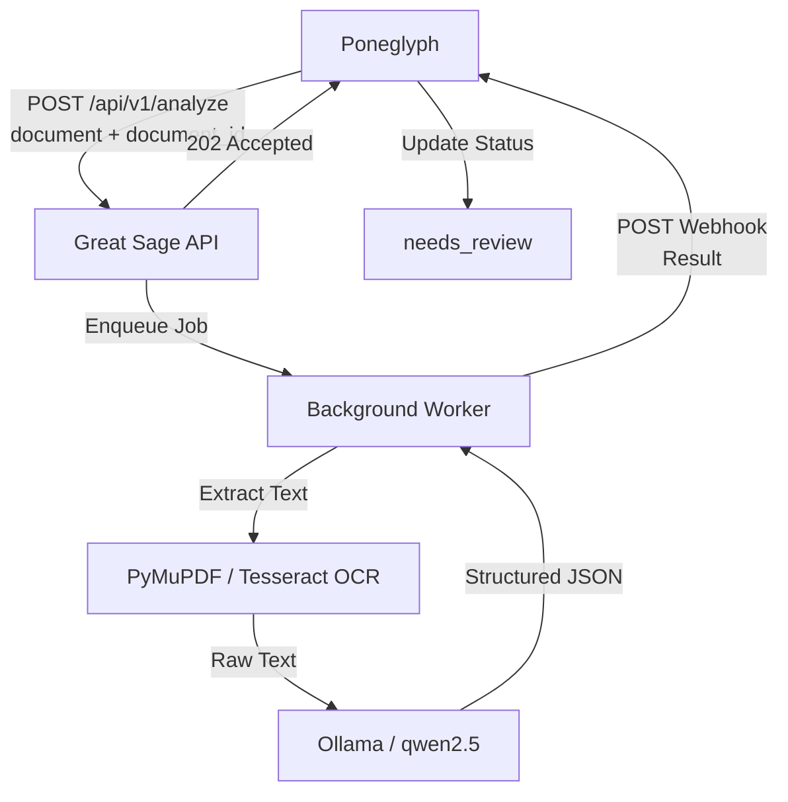

# Great Sage

Great Sage is an independent, local-first document intelligence engine designed to work seamlessly with Poneglyph (or DocuNest). It provides a robust, asynchronous pipeline for extracting structured metadata from unstructured documents without relying on external cloud AI providers.

## What is Great Sage?

- **Local Document Intelligence Service**: Entirely self-hosted and designed for privacy.
- **No External Cloud AI**: Your sensitive documents never leave your infrastructure.
- **Hybrid Processing**: Combines traditional OCR (Tesseract) with local LLM capabilities (Ollama) to understand document context.

## Responsibilities

Great Sage owns the entire document intelligence pipeline:
- PDF native text extraction (via PyMuPDF).
- Image preprocessing and enhancement (via PIL).
- Optical Character Recognition (via Tesseract).
- Local LLM integration (via Ollama).
- Document classification and metadata extraction using the `qwen2.5` model.
- Validation and sanitization of structured output.
- Asynchronous document processing queue.
- Secure webhook delivery of results back to Poneglyph.

## Architecture

Great Sage is strictly a processing engine. It receives work, performs inference, and pushes results back.



**What Great Sage does NOT own:**
To maintain a clean service boundary, Great Sage deliberately does **not** manage:
- Users, authentication, or authorization logic.
- Customer records.
- Relational databases (e.g., PostgreSQL).
- Document metadata storage or file ownership.
- File sharing or human review workflows.
- Audit logs.

## Project Structure

- `app/main.py`: The FastAPI application, route definitions, and lifecycle management.
- `app/auth.py`: API key validation logic for incoming requests.
- `app/config.py`: Centralized application settings loaded from environment variables.
- `app/ocr.py`: Native PDF extraction and image-based Tesseract OCR pipeline.
- `app/llm.py`: Ollama integration, prompt construction, and output sanitization.
- `app/pipeline.py`: The end-to-end processing orchestrator (OCR → LLM → Webhook) that handles graceful degradation.
- `app/schemas.py`: Pydantic models enforcing strict typed request/response contracts and webhook payloads.
- `app/worker.py`: An `asyncio.Queue` based background worker that decouples HTTP ingestion from processing.
- `app/webhook.py`: Secure HTTP client for pushing results back to Poneglyph.
- `tests/`: Comprehensive `pytest` suite validating all components.

## API

Great Sage provides a minimal API surface.

### `POST /api/v1/analyze`

Accepts a document for asynchronous processing.
- **Authentication**: Requires `X-API-Key` or `Authorization: Bearer` header.
- **Content-Type**: `multipart/form-data`
- **Fields**:
  - `file`: The binary file (PDF, PNG, JPG).
  - `document_id`: Integer ID for correlation.

**Example Request:**
```http
POST /api/v1/analyze HTTP/1.1
X-API-Key: your_secret_api_key
Content-Type: multipart/form-data; boundary=---boundary

-----boundary
Content-Disposition: form-data; name="document_id"

123
-----boundary
Content-Disposition: form-data; name="file"; filename="document.pdf"
Content-Type: application/pdf

<binary data>
-----boundary--
```

**Example Response:**
```http
HTTP/1.1 202 Accepted
Content-Type: application/json

{
  "message": "Document accepted for processing",
  "document_id": 123
}
```

### `GET /health`

Checks service health, including reachability of Tesseract and Ollama.

### Webhook Payloads (Sent to Poneglyph)

Upon completion, Great Sage sends a POST request to the configured `PONEGLYPH_WEBHOOK_URL` authenticated with `X-Webhook-Secret`.

**Success:**
```json
{
  "document_id": 123,
  "status": "success",
  "ocr_text": "Full extracted text...",
  "classification": {
    "document_type": "Invoice",
    "person_name": "Jane Doe",
    "dob": null,
    "document_id_number": "INV-2023-001"
  },
  "error_message": null
}
```

**Failure (e.g., Unreadable file / OCR crash):**
```json
{
  "document_id": 123,
  "status": "failed",
  "ocr_text": null,
  "classification": {},
  "error_message": "OCR processing failed"
}
```

**Graceful Degradation (OCR Success, LLM Failure):**
```json
{
  "document_id": 123,
  "status": "failed",
  "ocr_text": "Full extracted text...",
  "classification": {},
  "error_message": "AI classification failed: Ollama timeout"
}
```

## Configuration

Configure Great Sage via a `.env` file or environment variables. Do not commit real secrets to version control.

| Variable | Description |
| :--- | :--- |
| `GREAT_SAGE_API_KEY` | Secret key Poneglyph uses to authenticate with Great Sage. |
| `PONEGLYPH_WEBHOOK_URL` | The endpoint Great Sage calls with processing results. |
| `PONEGLYPH_WEBHOOK_SECRET` | Secret signed into webhook requests so Poneglyph can verify the sender. |
| `OLLAMA_URL` | URL of the local Ollama instance (default: `http://127.0.0.1:11434`). |
| `OLLAMA_MODEL` | The LLM model to use (default: `qwen2.5`). |
| `OLLAMA_TIMEOUT_SECONDS` | Maximum time to wait for LLM inference (default: `180`). |
| `MAX_UPLOAD_BYTES` | Maximum allowed file upload size (default: 15MB). |
| `MAX_OCR_TEXT_CHARS` | Maximum characters to extract via OCR (default: `50000`). |
| `MAX_LLM_INPUT_CHARS` | Maximum characters to feed into the LLM prompt (default: `3000`). |
| `MAX_AI_STRING_LENGTH` | Truncation limit for structured JSON fields (default: `255`). |
| `WORKER_QUEUE_SIZE` | Maximum number of documents held in the async queue (default: `64`). |

## Local Setup (Windows)

1. **Prerequisites:**
   - Install **Python 3.10+**.
   - Install **Tesseract OCR** (e.g., via UB Mannheim installer). Ensure it's in your system PATH or installed at `C:\Program Files\Tesseract-OCR\tesseract.exe`.
   - Install **Ollama**.

2. **Setup Ollama:**
   ```powershell
   ollama pull qwen2.5
   ollama run qwen2.5
   ```
   *(Keep this running, or ensure the Ollama service is active).*

3. **Clone and setup Python environment:**
   ```powershell
   git clone <repository_url>
   cd great-sage
   python -m venv venv
   .\venv\Scripts\Activate
   pip install -r requirements.txt
   ```

4. **Configuration:**
   Copy `.env.example` to `.env` and fill in the required variables (specifically the API keys and Webhook URL).

5. **Start the Service:**
   ```powershell
   uvicorn app.main:app --host 127.0.0.1 --port 8000 --reload
   ```

## Processing Flow

The asynchronous processing lifecycle:
1. **Upload:** Client POSTs a document and ID to `/api/v1/analyze`.
2. **202 Accepted:** The API immediately responds, confirming receipt.
3. **Background Processing:** The job is picked up by the `asyncio` worker.
4. **Extraction:** PyMuPDF attempts native text extraction. If it's a scanned image, PIL preprocesses it and Tesseract extracts the text.
5. **AI Classification:** The OCR text is safely truncated and sent to Ollama with a strict JSON formatting prompt.
6. **Validation:** The resulting JSON is parsed, and fields are sanitized to remove null bytes and respect length limits.
7. **Webhook:** The final payload (success or failure) is POSTed to Poneglyph.
8. **Poneglyph Updates:** Poneglyph updates the document status (e.g., to `needs_review`).

## Security

Great Sage is designed with strict security constraints:
- **API Key Authentication:** All incoming requests must bear the `GREAT_SAGE_API_KEY`.
- **Webhook Secrets:** All outbound webhooks are signed with `PONEGLYPH_WEBHOOK_SECRET` to prevent spoofing.
- **Fixed Webhook Destination:** Great Sage *never* accepts a webhook URL from the client request; it only posts to the URL defined in its environment variables, preventing SSRF attacks.
- **Input Validation:** Enforces strict file type allowances and hard size limits (`MAX_UPLOAD_BYTES`).
- **Memory Safety:** Files are processed in-memory where possible; if temp files were needed, they would be handled safely.
- **Prompt Injection Mitigation:** OCR text is aggressively truncated (`MAX_LLM_INPUT_CHARS`) before being fed to the LLM.
- **Local AI:** No data is sent to external, third-party APIs.
- **Service Isolation:** Great Sage has *zero* access to Poneglyph's PostgreSQL database.

## Development & Testing

Great Sage includes a comprehensive test suite covering the API, authentication, file validation, OCR truncation, LLM parsing, webhook delivery, and graceful degradation.

To run the tests:
```powershell
python -m pytest
```

Current test suite consists of 35 verified passing tests.

## Relationship with Poneglyph

- **Poneglyph** is the core application. It manages business logic, users, permissions, document storage, databases, and human review workflows.
- **Great Sage** is solely a **document intelligence engine**. It acts as a specialized worker node.

Great Sage must remain completely decoupled from Poneglyph's internal state. It is independently deployable and relies only on HTTP communication (API + Webhooks) to interact with the outside world.
